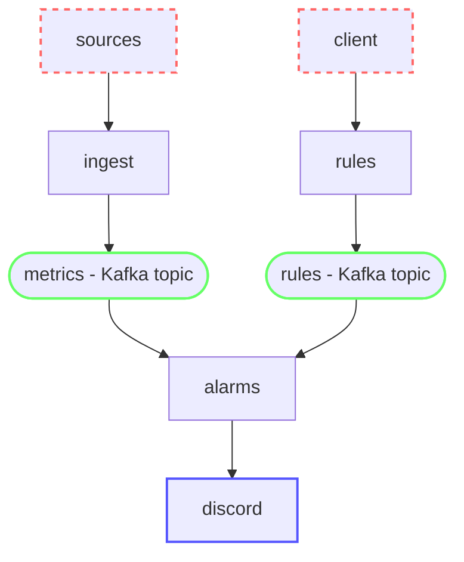

# Building a realtime monitoring system

Consider a package delivery company called Nozama that has huge fulfillment centers around the world. Each fulfilment center receives millions of packages every day, stores them and sends them to customers when they buy an item. 

The operation engineers at Nozama have been facing many incidents costing the company huge amounts of money:
- Conveyor belts usualy get stuck when they go above 10m/s.
- Automatic packaging machines malfunction when the internal temperature is above 35ºC.
- Too many packages accumulate at the entrance when more than 100k packages arrive in an hour.
- The time to package delivery is too high when more than 50k orders are received in an hour.
- Workers performance is much worse when the fulfillment center temperatur is above 28ºC.

Seeing the amount of issues that could be prevented by monitoring and being notified before things get worse, the engineers at Nozama have decided to start adding many monitoring (sensors, termometers, counters, ...) to many machines and processes.

They need you to build a realtime monitoring system such that:
- the system **ingests all the metrics in near-realtime**. For example: `fc.bcn1.packages.received` is the name of a metric they publish into the system with the number of packages received in the `bcn1` fulfilment center. 
- allow operations engineers to **create and update alarm rules**. For example: trigger an alarm when `fc.bcn1.packages.received` is above `1000`.
- process all the ingested metrics and **trigger any alarms in real-time according to the alarm rules** 
- **send notifications when an alarm is triggered** to a Discord channel 

We will call this system Super Simple Realtime Monitoring System (SSRMS).

# Table of contents

- [Grading](#grading). Where does the grade of this lab come from?
- [Required exercises](#required-exercises). You must deliver all these exercises to be awarded a 10.
    - [Seminar 5: Building the ingest service](#seminar-5-building-the-ingest-service) - 6 exercises (60 marks)
    - [Lab 5: Building the rules service](#lab-5-building-the-rules-service) - 3 exercises (45 marks)
    - [Lab 6: Building the alarms service](#lab-6-building-the-alarms-service) - 4 exercises (50 marks)

- [Design](#design). Read this section to understand the requirements and architecture of the system you must implement.
    - [ingest service](#ingest-service). How does the ingest service work?
    - [rules service](#rules-service). How does the rules service work?
    - [alarms service](#alarms-service). How does the alarms service work?

- [Additional exercises](#additional-exercises). You can deliver additional exercises for extra marks up to a maximum of 12 over 10.

# Grading

The grade for this lab is computed as:

```
lab3_grade = delivered_marks / required_exercises_total_marks * 10
```

The final labs grade is computed as:

```
labs_grade = (lab1_grade + lab2_grade + lab3_grade) / 3
```

If plagiarism is detected, `labs_grade` is a 0.

# Required exercises

## Seminar 5: Building the ingest service

During this seminar session, you must build the `ingest` service as described in [ingest service](#ingest-service).

### [S5Q0] [7 marks] Answer the following questions about Kafka.

> [!TIP]
> Answer each question briefly (at most, 3 sentences per question).

**[1 mark] What is a log? What is a topic? What is a partition?**

**[1 mark] What does the broker do? What is a producer? And a consumer?**

**[1 mark] What is a consumer group? What is a commit?**

**[1 mark] Is ordering guaranteed in Kafka?**

**[1 mark] What is the upper boundary when horizontally scaling Kafka consumers for a single topic?**

**[1 mark] Does each `alarms` service process only one metrics type or many?**

**[1 mark] Can two metrics of the same type end up in two different `alarms` services?**

---

### [S5Q1] [8 marks] Answer the following questions about Kafka compacted topics and materialized views.

> [!TIP]
> Answer each question briefly (at most, 3 sentences per question).

**[1 mark] What is the difference between a standard topic and a compacted topic?**

**[1 mark] What is a materialized view? Why do we use compacted topics to create materialized views?**

**[1 mark] If multiple horizontally scaled consumers want to each construct a materialized view of the full topic, must they be in the same or different consumer groups?**

**[1 mark] If multiple horizontally scaled consumers want to each construct a materialized view of the full topic, what are the benefits of having more than 1 partition?**

**[1 mark] What record represents a key deletion for a Materialzied View in a Kafka topic?**

**[3 mark] What is the benefit of a materialized view over an in-memory cache?**

---

### [S1Q2] [5 marks] Create Kafka topics

The [compose.kafka.yaml](./compose.kafka.yaml) file has a full Kafka deployment with 3 brokers. Start it with `docker compose up`.

Use the Kafka CLI to create two topics: `metrics` and `rules` (compacted):

```zsh
docker exec -it kafka-kafka-1-1 /bin/sh

export B="kafka-1:9092,kafka-2:9092,kafka-3:9092"

/bin/kafka-topics --bootstrap-server $B --create --topic metrics --partitions 20 --replication-factor 3
/bin/kafka-topics --bootstrap-server $B --create --topic rules --partitions 3 --replication-factor 3 --config cleanup.policy=compact

/bin/kafka-topics --bootstrap-server $B --list

exit
```

Paste a screenshot.

---

### [S1Q3] [30 marks] Implement the ingest API

Inside the [labs\3-kafka\ingest](./ingest/) folder, create a [Fastapi service with Docker](https://fastapi.tiangolo.com/deployment/docker/).

```
/ingest
    requirements.txt
    main.py
    Dockerfile
compose.kafka.yaml
compose.yaml
```

**[10 marks] Implement the [POST /metrics](#post-metrics) endpoint**.

**[20 marks] For every metric posted to /metrics, [publish it to the `metrics` Kafka topic](https://docs.confluent.io/kafka-clients/python/current/overview.html#initialization)**.

> [!TIP]
> You will need to [install the `confluent-kafka` package](https://docs.confluent.io/kafka-clients/python/current/overview.html#python-installation) and add it to the requirements.txt file.

You can use the `kafka-console-consumer` to see the contents of the topic in realtime:

```zsh
docker exec -it kafka-kafka-1-1 /bin/sh

export B="kafka-1:9092,kafka-2:9092,kafka-3:9092"

/bin/kafka-console-consumer --bootstrap-server $B --topic metrics --from-beginning --property print.key=true

exit
```

Paste a screenshot of how you use `curl` to post metrics and they are published to the Kafka topic. 

### [S1Q4] [5 marks] Dockerizing the ingest service

Add 5 instances of the `ingest` service to the [compose.yaml](./compose.yaml) file. Run the `ingest` services at `localhost:8081`, `localhost:8082`, ... and `localhost:8085`.

Verify it still works when running inside Docker. Paste a screenshot of how you use `curl` to post metrics and they are published to the Kafka topic (using the `kafka-console-consumer`). 

### [S1Q5] [5 marks] Run the simulated sources

Run `TODO` to start generating simulated metrics from the sources.

Paste a screenshot of how all the metrics are published to the Kafka topic (using the `kafka-console-consumer`). 

---

## Lab 5: Building the rules service

During this lab session, you must build the `rules` service as described in [rules service](#rules-service).

Inside the [labs\3-kafka\rules](./rules/) folder, create a [Fastapi service with Docker](https://fastapi.tiangolo.com/deployment/docker/).

```
/rules
    requirements.txt
    main.py
    Dockerfile
/ingest
    requirements.txt
    main.py
    Dockerfile
compose.kafka.yaml
compose.yaml
```

### [L5Q0] [20 marks] POST /rules

Implement the first endpoint of the `rules` API: [POST /rules](#post-rules).

**[10 marks] Implement the [POST /rules](#post-rules) endpoint**.

> [!TIP]
> Use the [`uuid.uuid4()`](https://stackoverflow.com/questions/534839/how-to-create-a-guid-uuid-in-python) method to generate the rule id.


**[10 marks] For every created rule, [publish it to the `rules` Kafka topic](https://docs.confluent.io/kafka-clients/python/current/overview.html#initialization)**.

Paste a screenshot of how you use `curl` to POST a rule it is published to the Kafka topic (using the `kafka-console-consumer`). 

---

### [L5Q1] [20 marks] DELETE /rules/{id}

Implement the other endpoint of the `rules` API: [DELETE /rules/{id}](#delete-rulesid).

**[10 marks] Implement the [DELETE /rules/{id}](#delete-rulesid) endpoint**.

**[10 marks] For every deleted rule, [publish it to the `rules` Kafka topic with a null body](https://docs.confluent.io/kafka-clients/python/current/overview.html#initialization)**.

Paste a screenshot of how you use `curl` to POST a rule, it is published to the Kafka topic, you  DELETE a rule with `curl` and it is published again to the Kafka topic with an empty value (using the `kafka-console-consumer`). 

---

### [S1Q2] [5 marks] Dockerizing the rules service

Add 1 instance of the `rules` service to the [compose.yaml](./compose.yaml) file. Run the `rules` service at `localhost:9091`.

Verify it still works when running inside Docker. Paste a screenshot of how you use `curl` to post and delete rules, and they are published to the Kafka topic (using the `kafka-console-consumer`). 

---

## Lab 6: Building the alarms service

During this lab session, you must build the `alarms` service as described in [alarms service](#alarms-service).

Inside the [labs\3-kafka\alarms](./alarms/) folder, create an empty `main.py` file with a Dockerfile and requirements.txt.

```
/rules
    requirements.txt
    main.py
    Dockerfile
/ingest
    requirements.txt
    main.py
    Dockerfile
/alarms
    requirements.txt
    main.py
    Dockerfile
compose.kafka.yaml
compose.yaml
```

---

### [L6Q0] [15 marks] Create the materialized view of rules

Use a [Kafka consumer](https://docs.confluent.io/kafka-clients/python/current/overview.html#ak-consumer) to consume the `rules` topic from the beginning and create a materialized view in memory with a dictionary.

When it works, [launch it in a background thread](https://stackoverflow.com/questions/2905965/creating-threads-in-python) so it can keep getting updates while we process metrics.

---

### [L6Q1] [15 marks] Consume metrics and match rules

Use a [Kafka consumer](https://docs.confluent.io/kafka-clients/python/current/overview.html#ak-consumer) to consume the `metrics` topic. For each received value, check if any of the rules in the materialized view trigger alarms.

---

### [L6Q2] [15 marks] Sending alarms to Discord

When a rule is triggered, use the `discord_webhook_url` to [send an alarm message to Discord](#sending-messages-to-discord).

---

### [L6Q3] [5 marks]. Deploying the alarms service with docker compose

Modify the `compose.yaml` file to also create 3 `alarms` services at ports 7071, 7072 and 7073.

Run `TODO` to start generating simulated metrics from the sources and manually test it works correctly.

---

# Design

> [!NOTE]
> This section outlines the requirements and design decisions of the architecture of SSRMS. You must implement a system that matches this design using Python.

> [!TIP]
> SSRMS system uses Kafka extensively. Read and study the [Kafka: a Distributed Messaging System for Log Processing](https://www.microsoft.com/en-us/research/wp-content/uploads/2017/09/Kafka.pdf?msockid=01dc1031619a67bb08ec049760dd66cc) paper.

SSRMS is composed of 3 services and many source clients:
- The [**sources**](#sources) send metrics into the system. For example, sensors, devices, and other services.
- The [**clients**](#clients) (Operation Engineers at Nozama) use the Rules API to create and update rules in the system.
- The [**ingest** service](#ingest-service) receives metrics through its API from `clients` and publishes the metrics to the `metrics topic`.
- The [**rules** service](#rules-service) allows users to create and update alarm rules through the API and stores them in the `rules (compacted) topic`.
- The [**alarms** service](#alarms-service) creates a materialized view from all the rules in the `rules (compacted) topic`, and consumes all metrics in the `metrics topic`. When a metric matches a rule, the service sends an alarm (message) to a Discord channel.

The following diagram represents the dependencies in the system. For example, `clients --> ingest` indicates that `clients` depends on `ingest` (`clients` uses the API of `ingest`).



### sources

The sources are all the devices that can integrate with SSRMS to send metrics. For example, other services, devices, temperature sensors, counters, etc.

Since we don't have said devices available, we have created [a script that simulates the devices](./sources/) when they publish metrics to the [Ingest API](#ingest-service).

### clients

The clients of SSRMS are the Operations Engineers from Nozama. Ideally, this would be an app or a website. However, for this prototype they will use `curl` to directly create and update rules using the [Rules API](#rules-service).

### ingest service

In SSRMS, there are many instances of the `ingest` service. I.e., the `ingest` service is scaled horizontally.

> [!TIP]
> Scaling the `ingest` service horizontally is very important because the number of sources and the amount of metrics they publish can be very large. This also allows the system to be highly available (i.e., if one `ingest` service breaks or is disconnected, the system can continue working with the other ones).

In order for the `sources` to send metrics, the `ingest` service exposes a simple HTTP API. The API for the `ingest` service only allows one operation:
- [Publish a metric](#post-metrics)

#### POST /metrics

The `sources` can send the value of a metric in realtime through this endpoint. The ingest service takes each metric value it receives and it publishes it to the `metrics` Kafka topic. The key in the Kafka topic must be the metric name, and the value a [JSON string](https://pythonexamples.org/python-dict-to-json/). For example:

```
fc.bcn1.packages.received -> {"value": 200}
```

For example, the `sources` can send a value of the `fc.bcn1.packages.received` metric to the `ingest` service with address `localhost:8080` as follows:

```
POST http://localhost:8080/metrics
```

Response:
```json
{
    "name": "fc.bcn1.packages.received",
    "value": 200
}
```

### rules service

In SSRMS, there can be many instances of the `rules` service. I.e., the `rules` service is scaled horizontally if necessary.

A rule is defined as the `discord_webhook_url` where alarms must be sent when the metric with name `metric_name` is higher than a `threshold` :

```json
{
    "id": "dc0d8a4c-46ea-4667-b6e9-eb7bf033fda9",
    "metric_name": "fc.bcn1.packages.received",
    "threshold": 500,
    "discord_webhook_url": "https://discordapp.com/api/webhooks/15434354352132/hfaslkdfhjsahldkf_02340lasdhf_fksdlf"
}
```

In order for the `clients` to create or delete `rules` to trigger alarms, the `rules` service exposes a simple HTTP REST API. The API for the `rules` service only allows 3 operations:
- [Create a rule](#post-rules)
- [Delete a rule](#delete-rulesid)

#### POST /rules

The `clients` can create a new rule through this endpoint. The `rules` service takes each new rule and publishes it to the `rules` Kafka topic. The key in the Kafka topic must be the rule id, and the value the [full rule as a JSON string](https://pythonexamples.org/python-dict-to-json/). For example:

```
dc0d8a4c-46ea-4667-b6e9-eb7bf033fda9" -> {
    "id": "dc0d8a4c-46ea-4667-b6e9-eb7bf033fda9",
    "metric_name": "fc.bcn1.packages.received",
    "threshold": 500,
    "discord_webhook_url": "https://discordapp.com/api/webhooks/15434354352132/hfaslkdfhjsahldkf_02340lasdhf_fksdlf"
}
```

For example, the `clients` can create a rule to send a Discord message when `fc.bcn1.packages.received` is higher than 500 in the `rules` service with address `localhost:9090` as follows:

```
POST http://localhost:9090/rules
```

Body:
```json
{
    "metric_name": "fc.bcn1.packages.received",
    "threshold": 500,
    "discord_webhook_url": "https://discordapp.com/api/webhooks/15434354352132/hfaslkdfhjsahldkf_02340lasdhf_fksdlf"
}
```

Response:
```json
{
    "id": "dc0d8a4c-46ea-4667-b6e9-eb7bf033fda9",
    "metric_name": "fc.bcn1.packages.received",
    "threshold": 500,
    "discord_webhook_url": "https://discordapp.com/api/webhooks/15434354352132/hfaslkdfhjsahldkf_02340lasdhf_fksdlf"
}
```

#### DELETE /rules/{id}

The `clients` can delete an existing rule through this endpoint. The `rules` service takes each deleted rule and publishes it to the `rules` Kafka topic with an empty value.

For example, the `clients` can delete a rule with id `dc0d8a4c-46ea-4667-b6e9-eb7bf033fda9` in the `rules` service with address `localhost:9090` as follows:

```
DELETE http://localhost:9090/rules/dc0d8a4c-46ea-4667-b6e9-eb7bf033fda9
```

Response:
```json
{}
```


### alarms service

In SSRMS, there are many instances of the `alarms` service. I.e., the `alarms` service is scaled horizontally.

> [!TIP]
> Scaling the `alarms` service horizontally is very important because the number of metrics received in the `metrics` topic can be very large. This also allows the system to be highly available (i.e., if one `alarms` service breaks or is disconnected, the system can continue working with the other ones).

The alarms service has no API. Instead, it reads from the `metrics` and `rules` Kafka topics, and sends alarm messages to Discord when a rule is matched. The following pseudo-code outlines the `alarms` service:

```
rules_materialized_view = {}
in a background thread {
    rules_consumer = Consumer("rules")
    while True {
        rule_id, new_rule = rules_consumer.poll()
        if new_rule == "" {
            rules_materialized_view.delete(rule_id)
        } else {
            rules_materialized_view[rule_id] = new_rule
        }
    }
}

metrics_consumer = Consumer("metrics")
while True {
    new_metric = metrics_consumer.poll()
    for rule in rules_materialized_view {
        if new_metric.name == rule.metric_name && new_metric.value > rule.threshold {
            send_discord_message(rule.discord_url)
        }
    }
}
```

#### the rules topic

The `alarms` service must poll the `rules` topic in a background thread and store all the rules in a dictionary. I.e., it must build a materialized view with all the rules in the topic.

When a rule is added or deleted, the `alarms` service will receive it in near real-time and update the materialized view.

#### the rules topic

The `alarms` service must poll the `metrics` topic. For each value received, it must check whether it is above the threshold for any of the rules configured for that metric. If it exceeds the threshold, it must send a message to Discord with the metric name, threshold and value.

#### sending messages to Discord

To send messages to Discord, [create a Discord server](https://discord.com/blog/starting-your-first-discord-server) for testing. Then, inside a text channel in your server, [create a Webhook](https://support.discord.com/hc/en-us/articles/228383668-Intro-to-Webhooks). Once you have copied the `Webhook URL`, you can make a POST request to send a message.

```zsh
curl -X POST {URL} -H 'Content-Type: application/json' -d '{"content": "Hello from curl"}'
```

# Additional exercises

You can delivery the following exercises for additional marks in the labs grade (and/or if you are interested in learning more)

### [ADQ0] [5 marks] Improve the `alarms` service rule matching algorithm

Instead of having a materialized view of `rule_id -> rule`, also materialize `metric_name -> rules` for faster O(1) access when processing metrics.


### [ADQ1] [5 marks] Extend the `rules` service with support for updating rules

Add a `PUT /rules/{id}` method to the `rules` API which allows updating an existing rule.


### [ADQ2] [15 marks] Extend the `rules` service with support for getting rules

Add a `GET /rules/{id}` and `GET /rules` methods to the `rules` API. You will need to add a consumer and a materialized view of rules in the `rules` service to support this usecase.

### [ADQ3] [20 marks] Create a web client for the rules service

Use the `rules` API to create a simple HTML + JS website that allows viewing, creating, updating and deleting rules.

### [ADQ4] [10 marks] Measure how many metrics per second the `ingest` service can handle

Measure how many metrics per second the `ingest` service can handle (i.e. load test it).

### [ADQ5] [10 marks] Use the docker compose `deploy` attribute to horizontally scale services

Instead of manually copying the services many times in the docker compose file to scale them horizontally, use the [deploy attribute](https://docs.docker.com/compose/compose-file/deploy/) to specify the number of replicas.

### [ADQ6] [25 marks] Add tagging support

Consider the usecase where we have many machines of type `convbelt`, and they all publish the same `fc.bcn1.convbelt.123.velocity` metric. Instead of publishing many metrics with different names depending on the fulfillment center and `convbelt` id, allow publishing metrics with tags. For example: `fc.convbelt.velocity` (tags: `fc:bcn1`, `convbelt:123`). Implement the necessary changes in `alarms`, `rules` and `ingest` services and APIs.

### [ADQ7] [10 marks] Add rule operator support

Add an additional attribute to `rules`: `operator`. The `operator` field can be `>` or `<`. Instead of always triggering alarms when the metric is above the threshold, these operators should allow triggering alarms when a metric is below a threshold. Implement the necessary changes in the `alarms` and `rules` services and APIs.

### [ADQ8] [25 marks] Add cooldown support

Add an additional attribute to `rules`: `cooldown_seconds`. Whenever a rule has sent an alarm notification to Discord, don't send any new alarms from that rule until `cooldown_seconds` have passed to avoid spamming the channel. Implement the necessary changes in the `alarms` and `rules` services and APIs.

### [ADQ9] [20 marks] Add windowing support

Add an additional attribute to `rules`: `type`. The `type` field can be `instantaneous` (default) or `window_average`. Instead of always triggering alarms when the metric is above/below the threshold, these operators should allow triggering alarms when the average in a `window_duration_seconds` window of the metric is above/below the threshold. Implement the necessary changes in the `alarms` and `rules` services and APIs.

